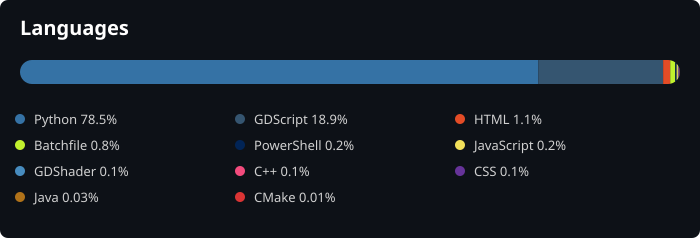

# github-lang-stats

Gera um SVG com a porcentagem de uso de cada linguagem somando **todos**
os seus repositórios do GitHub — públicos e privados — parecido com o
card "Most Used Languages".



> A imagem acima é o próprio `language-stats.svg` gerado pelo workflow.
> Como ele fica salvo neste repositório e o README o referencia com
> caminho relativo (`./language-stats.svg`), o gráfico aparece
> automaticamente pra qualquer pessoa que abrir esta página no GitHub —
> não precisa colocar em outro repositório nem em outro README.
> Na primeira execução do workflow o arquivo ainda não existe, então a
> imagem só aparece depois do primeiro run (manual ou automático).

## Como configurar

1. **Crie o repositório** no GitHub chamado, por exemplo, `github-lang-stats`
   (pode ser privado ou público — funciona nos dois casos) e suba estes
   arquivos nele.

2. **Crie um Personal Access Token (PAT)**:
   - Vá em GitHub → Settings → Developer settings → Personal access tokens
     → Fine-grained tokens (ou classic).
   - Dê o escopo `repo` (para enxergar repositórios privados) e
     `read:user`.
   - Copie o token gerado.

3. **Adicione o token como Secret** no repositório onde está este projeto:
   - Settings → Secrets and variables → Actions → New repository secret
   - Nome: `GH_PAT`
   - Valor: o token copiado no passo 2.

   > O `GITHUB_TOKEN` automático do Actions **não funciona** aqui, pois só
   > enxerga o próprio repositório onde a Action roda — por isso é
   > necessário um PAT pessoal.

4. **Pronto.** O workflow em
   `.github/workflows/update-language-stats.yml` roda todo dia às 06h
   (UTC) e sempre que você disparar manualmente em Actions → Run workflow.
   Ele gera/atualiza o arquivo `language-stats.svg` e faz commit
   automaticamente.

5. **Exiba o SVG** onde quiser, por exemplo no seu README de perfil:

   ```markdown
   
   ```

## Rodar localmente (teste)

```bash
pip install -r requirements.txt
export GH_TOKEN=ghp_xxx
python language_stats.py
```

Isso gera `language-stats.svg` na pasta atual e imprime o percentual de
cada linguagem no terminal.

## Como o cálculo funciona

Para cada repositório seu (públicos **e privados**), o script lê a árvore de
arquivos da branch padrão e soma o tamanho em bytes dos arquivos de código,
classificando pela extensão. Pastas geradas ou de dependências (`build/`,
`dist/`, `node_modules/`, `venv/`, ...) são ignoradas, então artefatos
commitados sem querer (por exemplo, o `build/` do PyInstaller) não distorcem
o resultado. Todas as linguagens encontradas aparecem no gráfico, sem
agrupar em "Other". Forks e repositórios arquivados são ignorados.

## Personalizações possíveis

- **Incluir forks/arquivados**: ajuste a condição em `aggregate_languages()`
  em `language_stats.py`.
- **Analisar uma organização**: defina `GH_USER=nome-da-org` (o token
  precisa ter acesso a ela).
- **Ignorar mais pastas**: adicione nomes em `IGNORED_DIRS`.
- **Reconhecer outra linguagem**: adicione a extensão em `EXTENSIONS` e a
  cor em `LANGUAGE_COLORS`.
